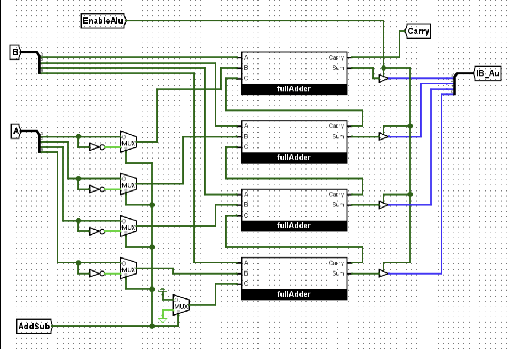
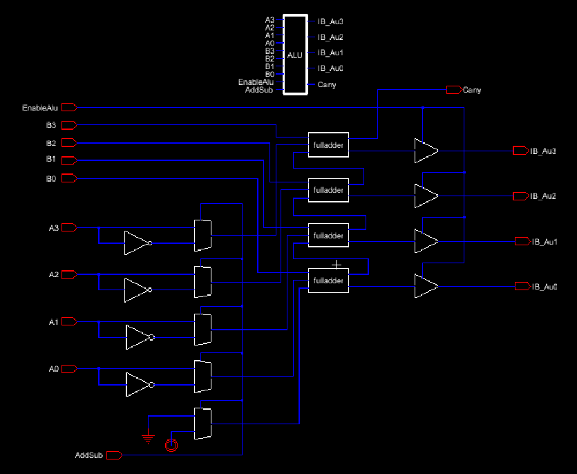
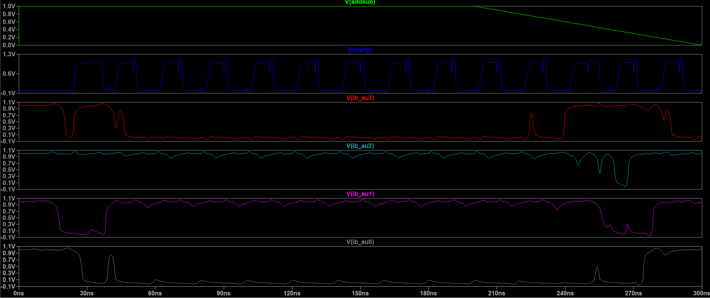
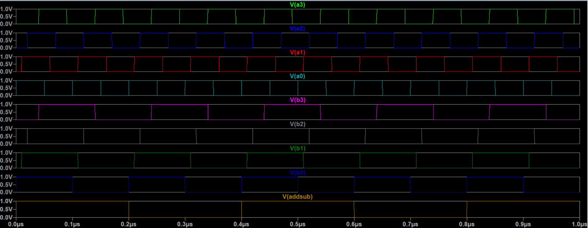
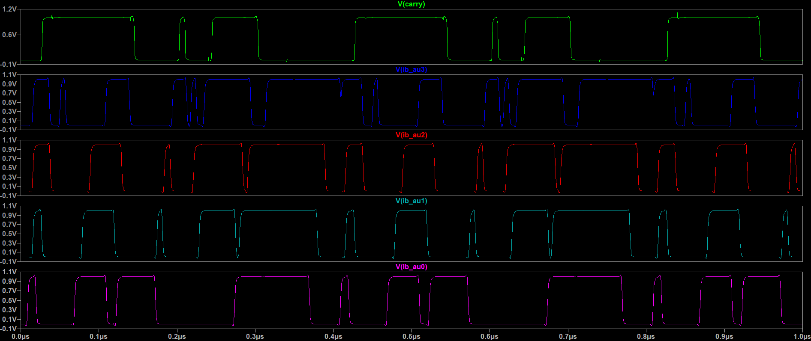
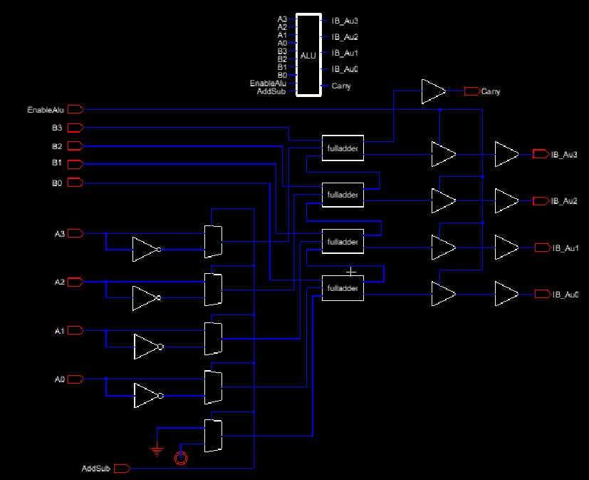
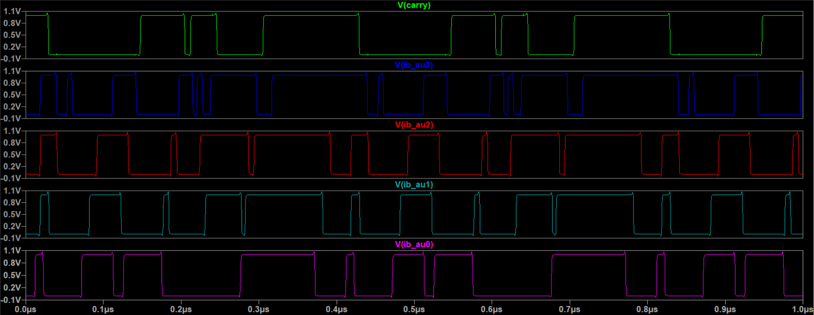
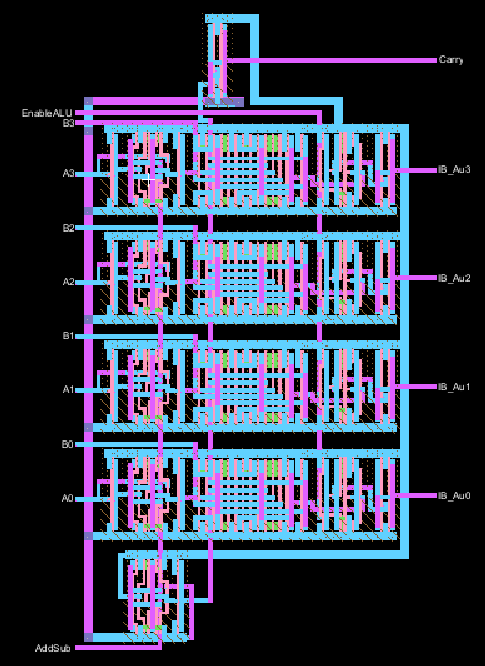
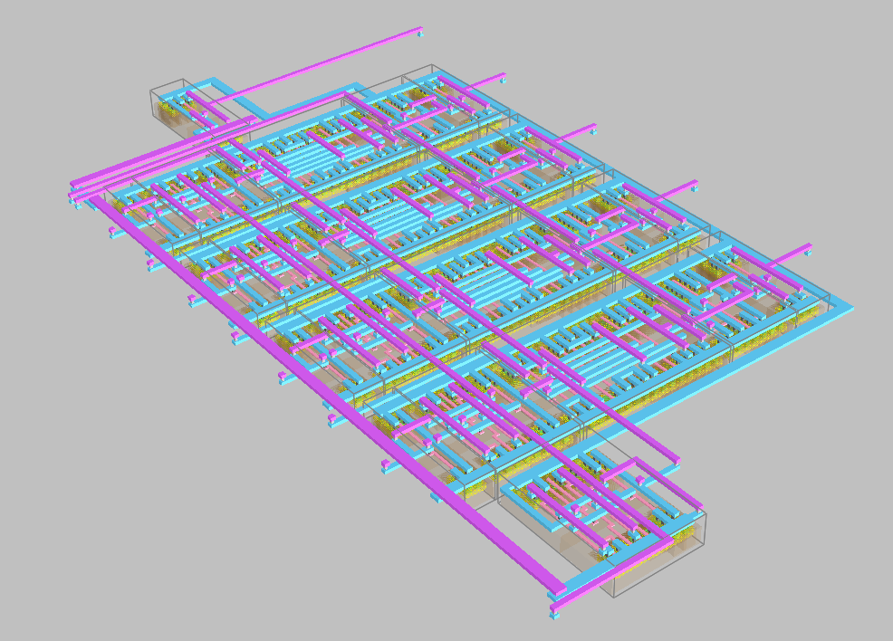

# 4-Bit CMOS ALU Design Report  
**Course:** ENCE 3501 – VLSI Design  
**Author:** Braidyn Sheffield  
**Date:** 11-14-2025

---

# Introduction
This project involved the design, simulation, and layout of a **4-bit CMOS Arithmetic Logic Unit (ALU)** using the Electric VLSI Design System.  
The objective was to translate a provided **Logisim behavioral ALU** into a functioning transistor-level circuit and complete the full VLSI design flow, including:

1. Study the logical behavior in Logisim  
2. Rebuild the ALU as a CMOS schematic  
3. Develop a SPICE testbench and simulate it  
4. Verify correct ALU operation
5. Implement the full layout  

---

# Logisim Reference Model
The design process began with analysis of the behavioral **Logisim ALU** supplied for the project.  
This model defined:

- Inputs: `A[3:0]`, `B[3:0]`  
- Control Signals: `AddSub` and `EnableALU`  
- Outputs: `IB_Au[3:0]` and `Carry`  
- Functional behavior: addition when `AddSub = 0`, subtraction when `AddSub = 1`  

This Logisim model provided the functional specification for the transistor-level implementation.

### Logisim Model  


---

# Transistor-Level Schematic Construction in Electric VLSI
Using the Logisim design as a reference, a corresponding transistor-level schematic was developed in Electric VLSI.

The schematic was constructed, including:
- Inverters for signal control  
- 2:1 multiplexers supporting the Add/Sub functionality  
- Full adder blocks connected in a ripple-carry configuration  
- Tri-state gating controlled by `EnableALU`  

### Initial ALU Schematic 


---

# Initial SPICE Simulation
A SPICE testbench was created to evaluate the transistor-level ALU.  
The first version used extremely fast PULSE sources:

```spice
VDD vdd 0 1.0

V_A0 A0 0 PULSE(0 1 0n 10p 10p 5n 10n)
V_A1 A1 0 PULSE(0 1 10n 10p 10p 5n 10n)
V_A2 A2 0 PULSE(0 1 20n 10p 10p 5n 10n)
V_A3 A3 0 PULSE(0 1 40n 10p 10p 5n 10n)

V_B0 B0 0 PULSE(0 1 0n 10p 10p 10n 20n)
V_B1 B1 0 PULSE(0 1 10n 10p 10p 10n 20n)
V_B2 B2 0 PULSE(0 1 20n 10p 10p 10n 20n)
V_B3 B3 0 PULSE(0 1 40n 10p 10p 10n 20n)

V_AddSub AddSub 0 PULSE(0 1 0n 10p 10p 20n 40n)
V_Enable EnableALU 0 DC 1

.tran 1p 300n
.include cmosedu_models.txt

```

These timing parameters were unrealistic for transistor-level CMOS simulation and produced unstable waveforms.


### Initial Simulation Output  


The resulting signals displayed mid-level voltages and severe distortion, indicating that the timing parameters were not appropriate.

---

# Timing Adjustment and Noise Identification
To correct the unrealistic behavior, the SPICE timing parameters were slowed significantly:

```spice
VDD vdd 0 1.0

V_A0 A0 0 PULSE(0 1 0n 100p 100p 50n 100n)
V_A1 A1 0 PULSE(0 1 10n 100p 100p 50n 100n)
V_A2 A2 0 PULSE(0 1 20n 100p 100p 50n 100n)
V_A3 A3 0 PULSE(0 1 40n 100p 100p 50n 100n)

V_B0 B0 0 PULSE(0 1 0n 100p 100p 100n 200n)
V_B1 B1 0 PULSE(0 1 10n 100p 100p 100n 200n)
V_B2 B2 0 PULSE(0 1 20n 100p 100p 100n 200n)
V_B3 B3 0 PULSE(0 1 40n 100p 100p 100n 200n)

V_AddSub AddSub 0 PULSE(0 1 0n 100p 100p 200n 400n)
V_Enable EnableALU 0 DC 1

.tran 1n 1u
.include cmosedu_models.txt

```

The slower simulation produced more realistic transitions, but the outputs still showed considerable noise.

### Slowed-Down Input Waveforms

After adjusting the PULSE timing parameters to more realistic values, the input transitions for `A[3:0]`, `B[3:0]`, and `AddSub` displayed clean and well-defined digital behavior. These input signals formed the basis for evaluating the ALU’s response under corrected timing conditions.




### Slower Simulation With Noise  


Further analysis revealed that the output stages lacked sufficient drive capability.

---

# Output Buffer Integration
To correct the observed signal integrity issues, **output inverter buffers** were added to:

- `IB_Au0`  
- `IB_Au1`  
- `IB_Au2`  
- `IB_Au3`  
- `Carry`  

These buffers provided strong output drive and eliminated the mid-rail and noisy transitions.

### Updated Schematic With Buffers  


### Final Clean Simulation Output  


The updated design produced clean 0–1 V logic transitions and correct ALU operation for both addition and subtraction.

---

# Physical Layout in Electric VLSI

## Layout Creation
After the schematic was verified, the full custom layout was created in Electric VLSI.

During the layout process, the structure of the ALU naturally organized into **four repeated physical sections**, each handling one bit of the ALU operation.  

The layout ultimately consisted of:
- **Four vertically stacked rows**, each corresponding to one ALU output bit  
- An additional cell above all rows for the Carry output buffer  
- A supplemental multiplexer cell at the bottom for Add/Sub selection  
- Continuous power and ground rails across all rows  
- Aligned well structures and uniform cell height  

### Final ALU Layout  


---

# 3D Layout Rendering
A 3D rendering was generated to visualize fabrication layers and assist in analyzing device topology.

### 3D Layout Rendering  


---

# Conclusion
This project successfully implemented the complete VLSI design flow for a 4-bit CMOS ALU.  
Beginning from a Logisim behavioral description, the design was translated into a transistor-level schematic, simulated and refined, and ultimately implemented as a custom CMOS layout.

The final ALU design demonstrates correct add/sub operation, clean logic transitions, and a complete custom layout suitable for fabrication.
