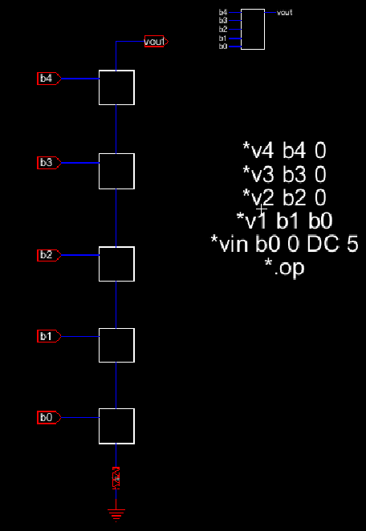

# ENCE 3501 – Lab 2 Report -  DAC Padframe
**Name:** Braidyn Sheffield     
**Date:** October 3, 2025  

---

## Introduction
The purpose of this lab is to design a die that connects the Digital-to-Analog Converter (DAC) from Lab 1 to the outside world using a padframe. This involves creating and analyzing the schematics of the pad cell, DAC, and padframe, followed by implementing the corresponding layout.

---

## Schematic

### Pad Cell Schematic  
  

**Explanation:**  
- The pad frame provides an electrical interface between the DAC circuit and the external pins
- There is a pad for each bit input for the DAC, as well as VCC and ground.

---

### DAC Schematic
  

**Explanation:**  
- The schematic above is the same schematic that was used in Lab 1.  

---

### Padframe with DAC Schematic
  

**Explanation:**  
- The padframe has a total of 8 pins. Integrating the DAC only required 7 pins, so pin 2 on the padframe is not used.
- The layout for the padframe with the DAC was created first to determine what pins of the padframe were going to each pin on the DAC to ensure that no overlaps were happening with the wires. Once the layout was done, the connections were copied over into the schematic.
---

## Layout

### Padframe with DAC Layout
  

**Explanation:**  
- While designing the layout of the padframe with the DAC in it, there were a few different considerations that needed to be decided:
    - The orientation of the DAC inside the pad frame to ensure that no metal traces overlapped
    - Where in the design we should place the metal 1 to metal 2 connectors to connect to the pads

### 3D Rendering of Padframe with DAC Layout
 
---

## Conclusion
During this lab we were able to create a pad, a 4 x 4 pad frame, and then taking our DAC from Lab 1 and connecting it to our padframe. After this lab, the skills of using connectors to move one layer to another and bringing in other designs into a new design to be used as building blocks is shown. We can now use different building blocks to create more complicated and sofisticated designs in the future.

---

## References
- Lab 1 Report  
- Lab 2 Walkthrough
- Class Notes

