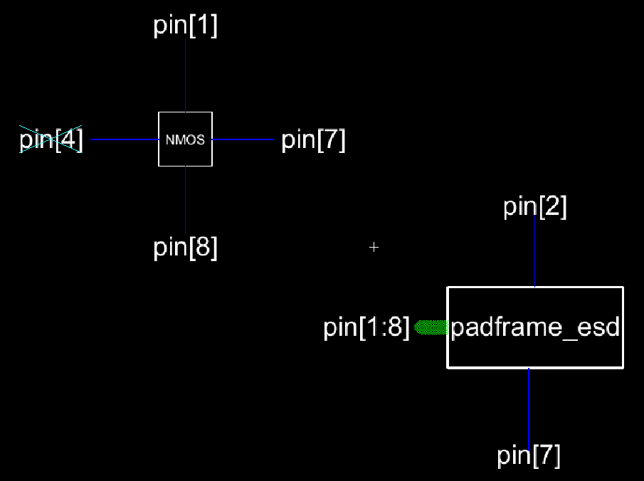

# ENCE 3501 – Lab 3 Report – NMOS Padframe with ESD Protection
**Name:** Braidyn Sheffield  
**Date:** October 10, 2025  

---

## Introduction
The purpose of this lab is to design a die that connects an NMOS transistor to the outside world using a padframe with ESD (Electrostatic Discharge) protection. This design focuses on building the schematic and layout for the pWell–nActive and pActive–nWell diodes, the pad cell with ESD protection, and finally the padframe that houses the NMOS. The lab introduces ESD-protected interfaces that ensure safe external connections to the integrated circuit.

---

## Schematic

### pWell–nActive and pActive–nWell Diodes

**Explanation:**  
- The **pWell–nActive** and **pActive–nWell** diodes are used as protection devices against ESD events.  

---

### Pad Cell with ESD Protection

**Explanation:**  
- The pad cell includes both ESD protection diodes connected between the pad and the power rails.  

---

### Padframe with VDD and GND Bus

**Explanation:**   
- The pad frame is made up of 8 pads. Choosing 8 pads was done in class, but 4 pads would have been sufficient for the design
- Each pad is connected to the vdd and gnd rails and using a bus to connect to the other six available pins.

---

### Padframe with NMOS Integrated

**Explanation:**  
- The NMOS transistor is placed in the center of the padframe, with its drain, gate, source, and base connected to pads.   
- This schematic connects all NMOS pinouts to the external world through protected pads.  

---

## Layout

### pWell–nActive and pActive–nWell Diodes Layout

---

### Pad Cell with ESD Protection Layout

**Explanation:**  
- The layout includes both diodes adjacent to the pad, tied to the VDD and GND rails.  
- Metal1 and Metal2 layers are used for routing.  
- DRC and LVS checks confirmed the layout matched the schematic.  

---

### Padframe with NMOS Layout

**Explanation:**  
- The padframe is square, with the NMOS layout placed at the center.  
- The VDD and GND buses run along the perimeter, connecting all pad cells.  
- The routing was designed to minimize overlap.  

---

### 3D Rendering of Final Layout

---

## Conclusion
This lab demonstrated the design of a padframe with integrated ESD protection for connecting an NMOS transistor to external pins. By creating both schematic and layout designs for diodes, pad cells, and the complete padframe, this project showed the implementation of ESD protection in IC design. The layout passed DRC and LVS verification, confirming correct device connectivity and adherence to design rules.

---

## References
- ENCE 3501 Lab 3 Handout  
- Class Notes  
