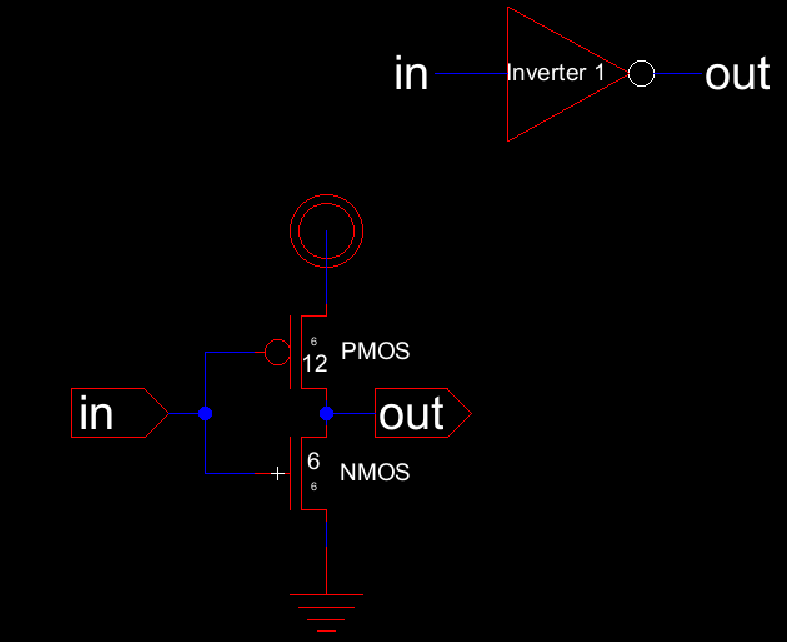

# ENCE 3501 – Lab 4 Report – CMOS Inverter Design
**Name:** Braidyn Sheffield  
**Date:** October 17, 2025  

---

## Introduction
The purpose of this lab is to design, simulate, and layout two CMOS inverters of different transistor sizes to analyze their switching characteristics and performance under various capacitive loads. The lab focuses on understanding how transistor sizing impacts switching threshold. 

Two inverters were designed with the following transistor widths and lengths:
- **Inverter 1:** PMOS = 12 µm / 6 µm, NMOS = 6 µm / 6 µm  
- **Inverter 2:** PMOS = 48 µm / 6 µm, NMOS = 24 µm / 6 µm (with M = 4)  

---

## Schematic

### Small CMOS Inverter (12 µm / 6 µm, 6 µm / 6 µm)

**Explanation:**  
- The inverter consists of one PMOS and one NMOS transistor connected together.  
- The PMOS transistor is connected to **VDD** and the NMOS to **GND**.  
- The input signal **Vin** controls both gates, and the output **Vout** is taken from the common node.   

---

### Large CMOS Inverter (48 µm / 6 µm, 24 µm / 6 µm × M = 4)

**Explanation:**  
- This inverter uses a **multiplier factor (M = 4)**.  
- Larger transistors reduce output resistance, enabling faster switching under heavy load conditions.  

---

### Simulation Setup

#### DC Sweep (Switching Threshold)

**Explanation:**  
- The `.dc` command sweeps the **input voltage (Vin)** from 0 V to 5 V in 1 mV steps.  
- This shows how the inverter output changes as the input increases.  
- From the plot, the **switching point (Vm)** is closer to 2.5V with Inverter 1. Inverter 2 has a lower switching point.

---

#### Transient Simulation with Capacitive Loads

**Explanation:**  
- A **pulse waveform** (`pulse(0V 5V 5n 1n 1n 12n 25n)`) is used as the input signal.  
- The `.step` command runs the simulation for four capacitive loads: **100 fF**, **1 pF**, **10 pF**, and **100 pF**.  
- The `.tran 0 25n 0 100p` command runs the transient simulation for 25 ns with a 100 ps step.  
- These runs show how the inverter’s output speed changes with different load values.  

---

#### Small Load Test

**Explanation:**  
- This setup tests very small loads: **1 fF**, **10 fF**, and **100 fF**.  
- It helps show how smaller loads switch faster and with less delay.  
- The same pulse input is used to keep the results consistent.  

---

**Summary:**  
The DC sweep shows where the inverter switches between logic 0 and logic 1.  
The transient tests show how quickly the inverter responds with different capacitive loads.  
Smaller loads switch faster, while larger loads cause slower rise and fall times.

## Layout

### Small Inverter Layout

**Explanation:**  
- **VDD** runs along the top of the layout in **Metal1**, and **GND** runs along the bottom.  
- The PMOS and NMOS transistors are placed vertically with their drains connected together at the output.   
- The design passed both **DRC** and **LVS** checks, confirming it matches the schematic.  

---

### 3D Rendering of Small Inverter

**Explanation:**  
- The 3D view shows the vertical alignment of PMOS and NMOS transistors.  
- The top layer shows the **VDD** rail and the bottom shows the **GND** rail.  

---

### Large Inverter Layout

**Explanation:**  
- The large inverter follows the same layout pattern but uses **wider regions** and **multiplied transistors** to represent **M = 4**.  
- This increases drive strength and allows faster switching at higher loads.  
- The design also passed DRC and LVS checks.  

---

### 3D Rendering of Large Inverter

**Explanation:**  
- The 3D view shows the increased width and repeated transistor fingers used for **M = 4**.  
- The structure highlights the larger area needed for stronger current.  

---

## Discussion
The results confirmed that **inverter size** and **load capacitance** directly affect switching speed and power consumption.  
- The **small inverter** demonstrated efficient switching for light loads but slower response under heavy loads.  
- The **large inverter** exhibited higher power consumption but superior drive strength and reduced propagation delay.  
- The use of **M = 4** effectively multiplied current drive, enhancing speed while increasing layout area.  

---

## Conclusion
This lab demonstrated the design, simulation, and layout of CMOS inverters with varying transistor sizes. Through schematic design, simulation, and layout verification, the trade-offs between speed, power, and area were explored. Larger transistors provided faster switching and better drive capability but at the cost of increased area and parasitic effects.  

---

## References
- ENCE 3501 Lab 4 Handout  
- Class Notes  

---
