# ENCE 3501 – Lab 5 Report – Full Adder Design
**Name:** Braidyn Sheffield  
**Date:** October 31, 2025  

---

## Introduction
The purpose of this lab was to design, simulate, and layout CMOS logic gates and a 1-bit full adder using 6 µm / 2 µm PMOS and NMOS transistors. The lab focused on developing transistor-level schematics for a **2-input NAND gate**, **2-input XOR gate**, and **NOT gate**, and then combining these into a **1-bit Full Adder**.  
Each circuit was created as a standard cell for modularity, simulated for all possible input combinations, and verified through **DRC** and **NCC** checks.

---

## Part 1 – Gate Design

### NAND Gate Schematic
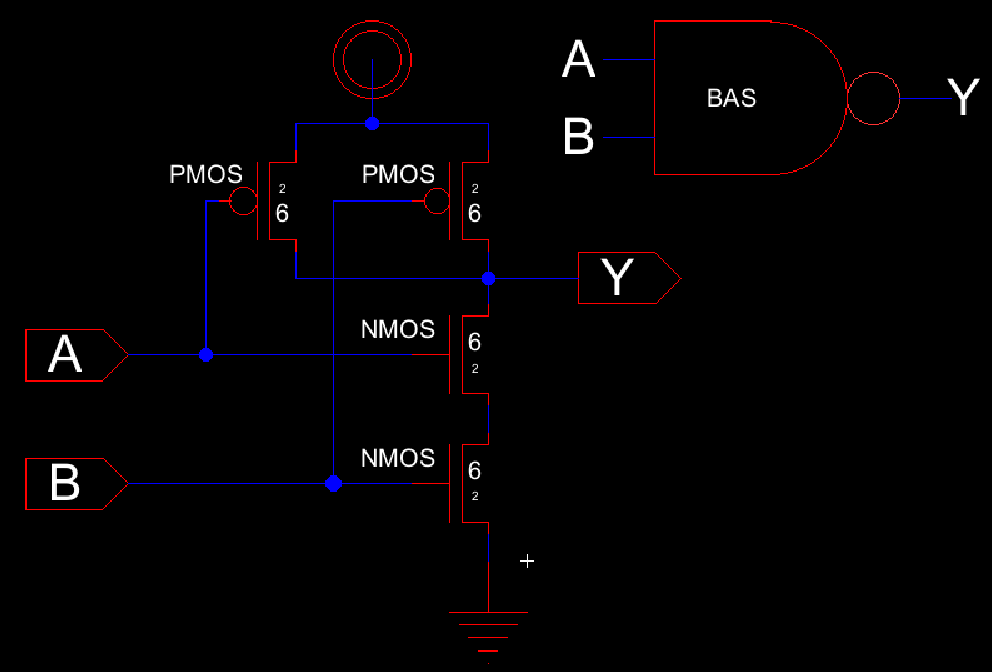

**Explanation:**  
- Built using **two PMOS transistors in parallel** and **two NMOS transistors in series**.  
- Inputs A and B drive both transistor gates; the output Y is taken from the common drain node.  
- Logic function: **Y = ¬(A ⋅ B)**  

---

### NAND Gate Transient Simulation
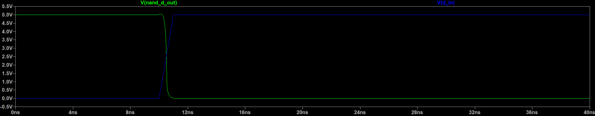

**Explanation:**  
- Verified output transitions.
- Output remained HIGH except when A = B = 1.  
- Transition edges demonstrated expected inversion behavior.  

---

### NAND Gate Truth Table Simulation (TT Sim)
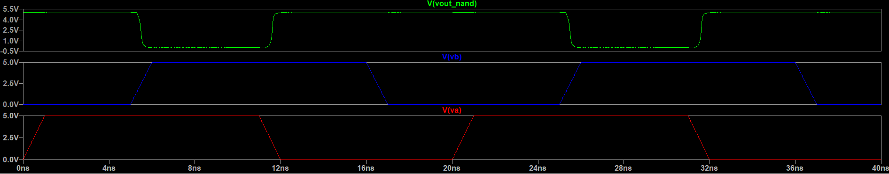

**Explanation:**  
- The **TT (Truth Table)** simulation verifies logical accuracy by cycling through all input combinations.  
- Output remains HIGH for all cases except when both inputs are HIGH, matching NAND logic.  

| A | B | Y (Output) |
|:-:|:-:|:-:|
| 0 | 0 | 1 |
| 0 | 1 | 1 |
| 1 | 0 | 1 |
| 1 | 1 | 0 |

---

### NAND Gate Layout
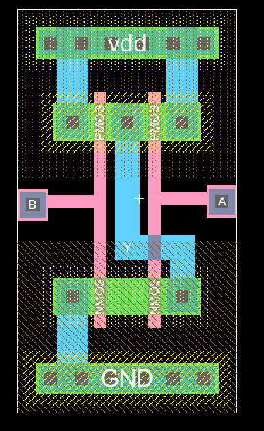

**Explanation:**  
- Implemented as a **standard cell** with Metal1 routing for VDD, GND, inputs, and output.  
- PMOS devices placed above NMOS devices with a shared drain connection.  
- Layout passed both **DRC** and **NCC** verification.  

---

### XOR Gate Schematic
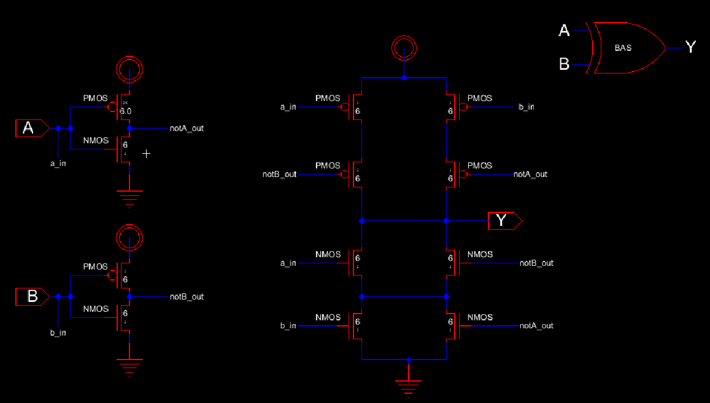

**Explanation:**  
- Constructed from multiple transistor stages to implement A ⊕ B.  
- Outputs HIGH only when A ≠ B.  
- Maintains 6 µm / 2 µm transistor dimensions.  

---

### XOR Gate Transient Simulation
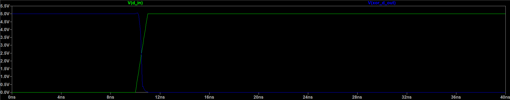

**Explanation:**  
- Verified transition behavior for input.  
- Clear switching between logic states observed.  
- Slight delay due to stacked transistor structure.  

---

### XOR Gate Truth Table Simulation (TT Sim)
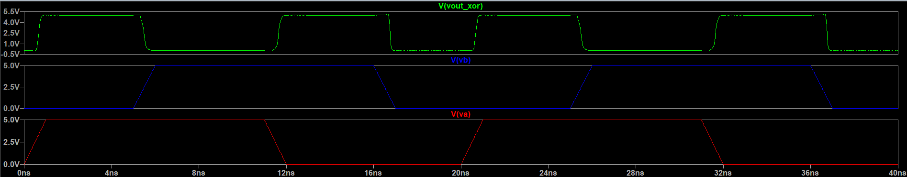

**Explanation:**  
- The **TT (Truth Table)** simulation confirms that the XOR output is HIGH only when A and B differ.  
- The results match the theoretical XOR logic relationship **Y = A ⊕ B**.  
- Demonstrates correct logic transitions for all four input combinations.

| A | B | Y (Output) |
|:-:|:-:|:-:|
| 0 | 0 | 0 |
| 0 | 1 | 1 |
| 1 | 0 | 1 |
| 1 | 1 | 0 |

---

### XOR Gate Layout
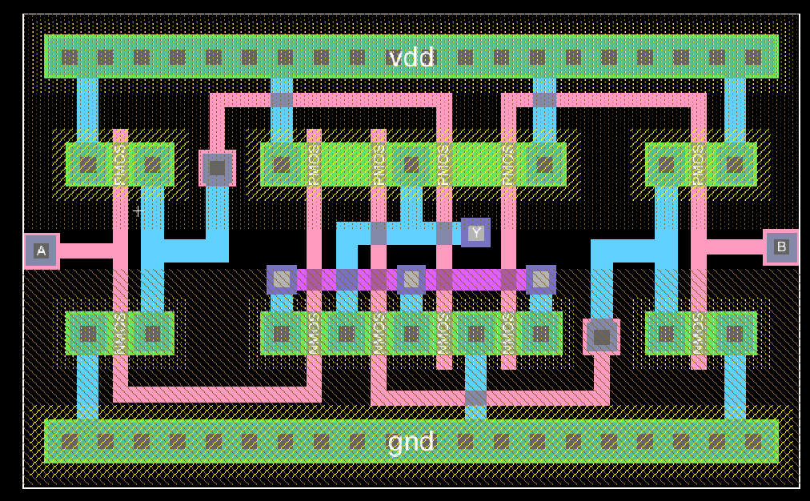

**Explanation:**  
- Larger layout area due to multiple transistor pairs.  
- Maintained standard-cell alignment with VDD and GND rails.  
- Passed DRC and NCC checks.  

---

### NOT Gate Schematic
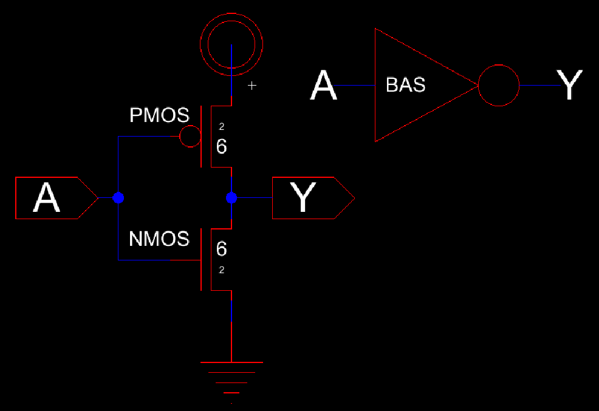

**Explanation:**  
- Implemented as a single PMOS and NMOS pair with a shared output node.  
- Provides logic inversion: **Y = ¬A**.  
- Transistor sizes match 6 µm / 2 µm specification.  

---

### NOT Gate Transient Simulation
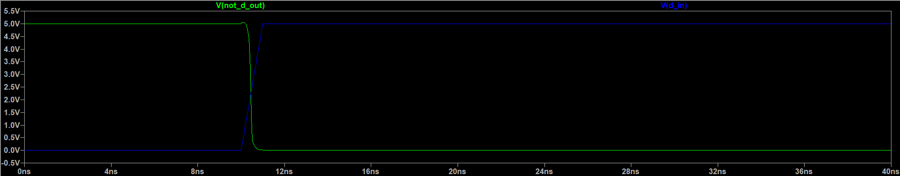

**Explanation:**  
- Output switches opposite to the input signal, confirming inversion.  
- Clean transition edges demonstrate stable operation.  

---

### NOT Gate Layout
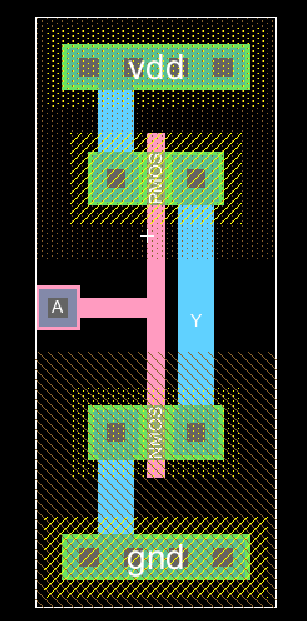

**Explanation:**  
- Compact standard cell layout with top VDD and bottom GND rails.  
- Verified to be DRC- and NCC-clean.  

---

### Timing Glitch Analysis
During transient simulations, brief **glitches** were observed on the output of both the XOR and NAND gates when input transitions occurred nearly simultaneously. These glitches occur because:
- The propagation delay of each transistor path differs slightly due to variations in capacitance and drive strength.
- When one input changes before the other, a temporary mismatch in the logic evaluation path can cause a **momentary spike or dip** in the output voltage.

For example:
- In the **XOR gate**, when both A and B transition from 0 → 1, intermediate nodes briefly assume a state that momentarily drives the output HIGH before returning LOW.

---

## Part 2 – Full Adder Design

### Full Adder Schematic
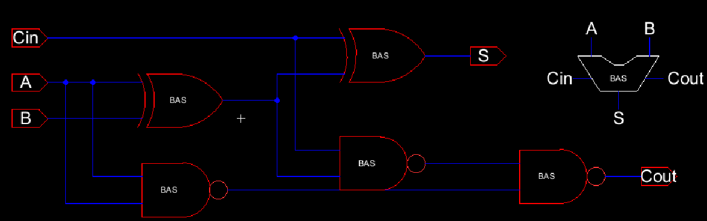

**Explanation:**  
- Constructed using two XOR gates, two AND gates (derived from NAND and NOT), and one OR gate.  
- Inputs: A, B, Cin → Outputs: Sum, Cout.  

---

### Full Adder Truth Table Simulation (TT Sim)
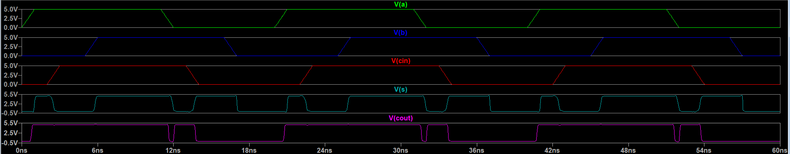

**Explanation:**  
- The **TT (Truth Table)** simulation validates the functional correctness of the full adder circuit.  
- The Sum and Cout outputs match theoretical values for all eight possible input combinations.  
- Confirms accurate logical and timing behavior of the full adder.

| A | B | Cin | Sum | Cout |
|:-:|:-:|:---:|:---:|:----:|
| 0 | 0 | 0 | 0 | 0 |
| 0 | 0 | 1 | 1 | 0 |
| 0 | 1 | 0 | 1 | 0 |
| 0 | 1 | 1 | 0 | 1 |
| 1 | 0 | 0 | 1 | 0 |
| 1 | 0 | 1 | 0 | 1 |
| 1 | 1 | 0 | 0 | 1 |
| 1 | 1 | 1 | 1 | 1 |

---

### Full Adder Transient Simulation

**Explanation:**  
- Displays timing behavior of Sum and Cout outputs as inputs toggle.  
- Both outputs transition according to expected logic relationships.  

---

### Full Adder Layout 1
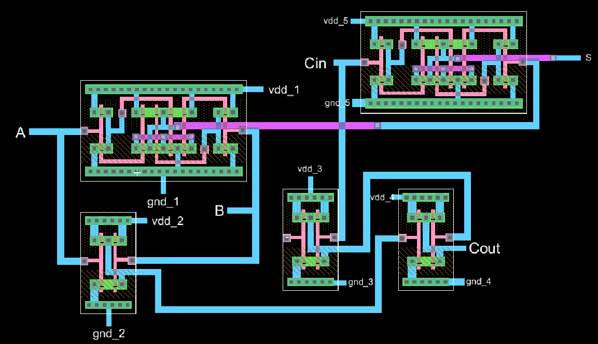

**Explanation:**  
- Alternate view showing layout that aligns with schematic placement.  
- Inputs and outputs routed in Metal2 (per lab specifications).  
- Passed both DRC and NCC verification.   

---

### Full Adder Layout 2
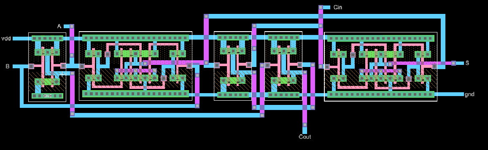

**Explanation:**  
- Standard-cell layout showing the placement of the five logic blocks.  
- VDD and GND rails run continuously for all connected gates.   

---

## Discussion
This lab demonstrated how CMOS logic cells can be combined to form a complete 1-bit Full Adder.  
- **NAND**, **XOR**, and **NOT** gates served as fundamental building blocks.  
- **Timing glitches** can occur when input transitions are not synchronized, especially in multi-stage circuits.  
- Using standard cell frames simplifies power routing and layout connectivity.  

---

## Conclusion
This lab successfully implemented and verified 2-input NAND, 2-input XOR, and NOT gates and used them to construct a 1-bit CMOS Full Adder. Each circuit was tested for functionality and passed both **DRC** and **NCC** checks. The designs illustrate the importance of layout planning, timing analysis, and modular design in VLSI systems.

---

## References
- ENCE 3501 Lab 5 Handout
- Class Notes  
