# ENCE 3501 – Lab 6 Report – DC-to-DC Charge Pump Regulator
**Name:** Braidyn Sheffield  
**Date:** November 7, 2025  

---

## Introduction
The purpose of this lab was to design, simulate, and layout a **DC-to-DC Charge Pump Regulator** using CMOS transistor-level circuits.  
The goal was to produce a stable **2 V output** using a combination of subcircuits built in Electric and simulated in SPICE.

The system consisted of:
1. A **charge pump** to multiply voltage.  
2. A **ring oscillator with an enable pin** to generate clock signals.  
3. A **regulator circuit** to control and stabilize the output voltage.  

---

## Part 1 – Subsystem Design

### 3-Stage Charge Pump Schematic
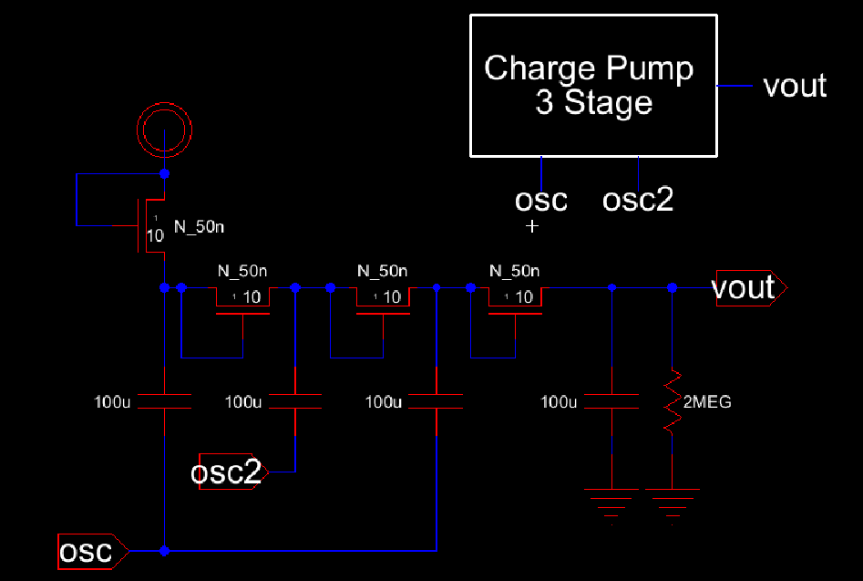

**Explanation:**  
Built with three pumping stages using transistors and capacitors.  
Each stage transfers charge during clock transitions to increase the output voltage.

---

### 3-Stage Charge Pump Layout
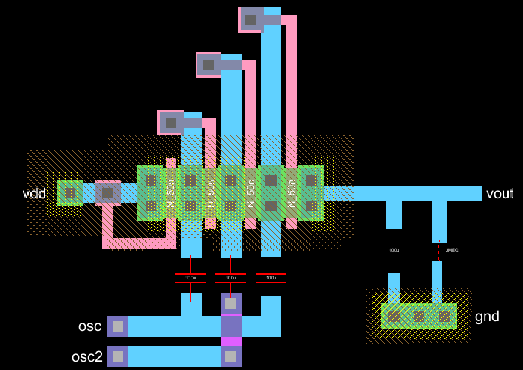

**Explanation:**  
**Schematic symbols for resistors and capacitors were added only to show connectivity in the layout.**  
They were not physically implemented because the required device sizes would be very large on-chip.  
As a result, **DRC and NCC errors were expected and acceptable** for these placeholder components.

---

### 3-Stage Charge Pump Simulation
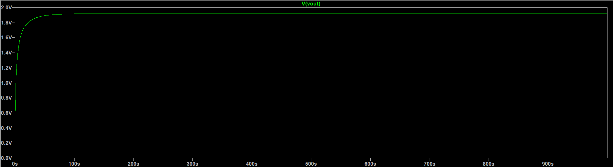

**Explanation:**  
Output reached about **1.8–1.9 V**.  
Voltage increased step by step through the stages, confirming the pump worked but needed more stages for 2 V.
Simulation did not match exactly as lab walk through for unknown reasons. The same output voltage was acheieved, but no noise was seen in the simulation.

---

### 5-Stage Charge Pump Schematic
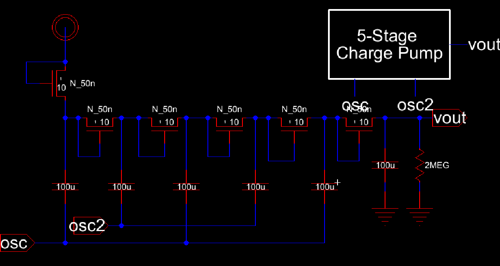

**Explanation:**  
Expanded to five stages to reach a higher voltage.
More stages reduce voltage loss from transistor drops and provide higher output.

---

### 5-Stage Charge Pump Layout
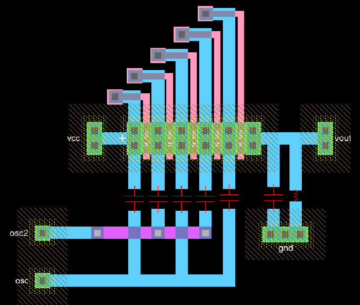

**Explanation:**  
Extended version of the 3-stage layout.  
Used the same routing style and added two extra stages.
**Resistors and capacitors were added as schematic symbols to show how they connect to the rest of the circuit.**  
They were not physically implemented due to their large required size.  
The layout therefore produced **expected DRC/NCC violations** but clearly demonstrated connectivity.

---

### 5-Stage Charge Pump Simulation
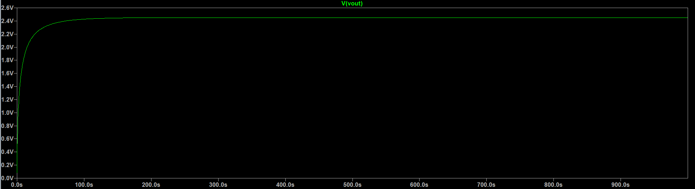

**Explanation:**  
Output rose smoothly and stabilized around **2.4 V**.  
The 5-stage design achieved the voltage goal and responded quickly at startup.

---

### Ring Oscillator with Enable Pin Schematic
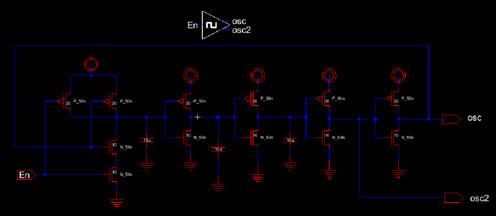

**Explanation:**  
Made with a NAND gate and four inverters in a loop.  
The enable pin starts or stops oscillation to control the charge pump.

---

### Ring Oscillator Layout
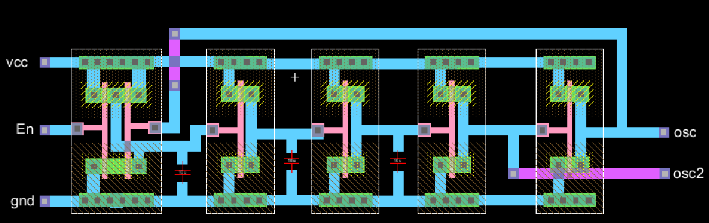

**Explanation:**  
Built using standard inverter cells as well as a standard NAND cell.  

---

### Ring Oscillator Simulation
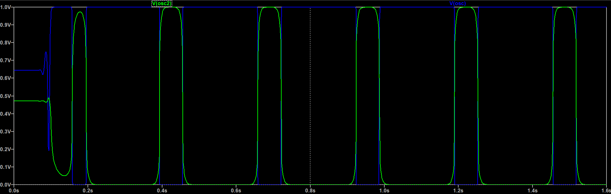

**Explanation:**  
Generated a clean, square clock signal when enabled.  

---

### Regulator Circuit Schematic
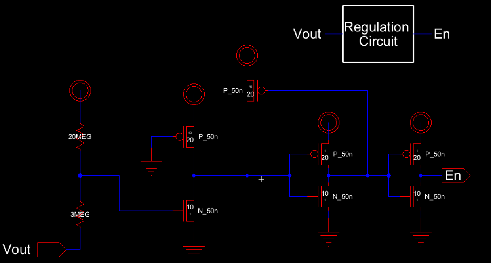

**Explanation:**  
Used a voltage divider to keep the output near 2 V.  
Controls the oscillator enable signal to regulate voltage.

---

### Regulator Circuit Layout
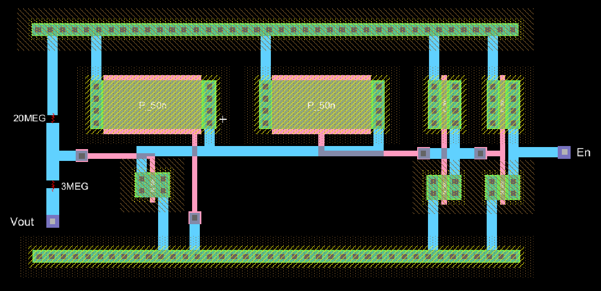

**Explanation:**  
Included feedback routing from Vout to the comparator input.  

---

### Regulator Simulation
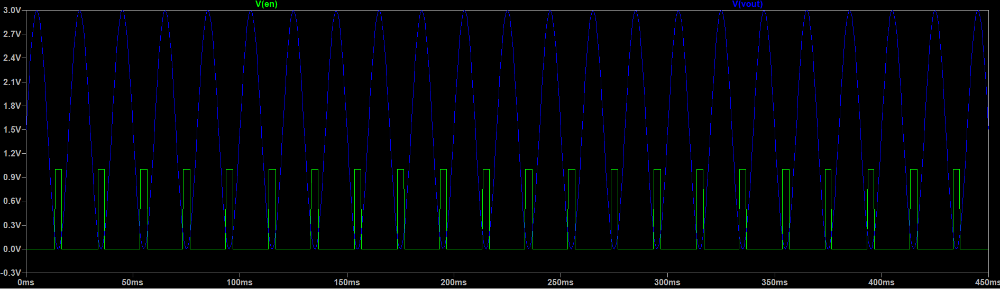

**Explanation:**  
Output stayed close to 3 V by turning the oscillator on and off.  

---

## Part 3 – Full System Integration

### Complete System Schematic
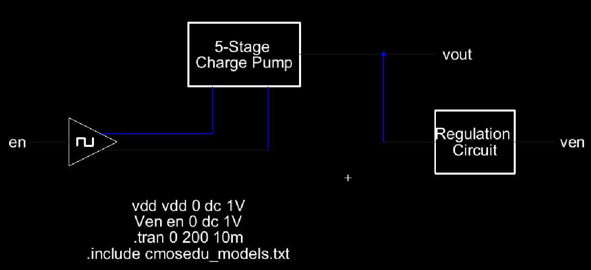

**Explanation:**  
Combined the **5-stage charge pump**, **ring oscillator**, and **regulator** into a full DC-to-DC converter.

---

### Complete System Layout
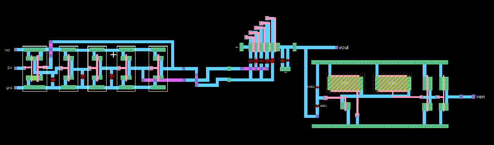

**Explanation:**  
Combined the **5-stage charge pump**, **ring oscillator**, and **regulator** into a full DC-to-DC converter.

---

### Full System Transient Simulation
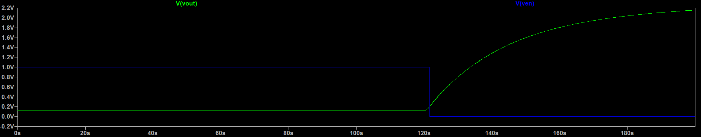

**Explanation:**    
The final voltage settled slightly **above 2 V**, which is normal for light-load conditions.  
The regulator kept the output stable once it reached steady state.

---

### Note on Large Passive Components (Resistors and Capacitors)
The resistors and capacitors used in this design were too large to implement physically on-chip.  
All simulations used **ideal schematic components** instead.  
In layout, resistor and capacitor symbols were added only for visual reference, which caused **DRC/NCC errors**.  
This was expected since these elements were not real PDK devices.

---

## Discussion
Each subsystem worked as expected.  
The 5-stage charge pump reached the target voltage, and the regulator maintained it near 2 V.  
The small overshoot above 2 V was acceptable.  
The system stayed stable, and the simulations matched design expectations.

---

## Conclusion
A **DC-to-DC Charge Pump Regulator** was designed, laid out, and simulated using a 5-stage charge pump.  
The final circuit produced a regulated output near **2 V** with a small overshoot.  
All subsystems functioned correctly in SPICE, and the layout demonstrated proper structure even though ideal passives caused DRC/NCC errors.  
This design successfully shows how CMOS charge pumps and regulators can generate on-chip supply voltages.

---

## References
- ENCE 3501 Lab 6 Handout   
- Class Notes and Lecture Slides  
